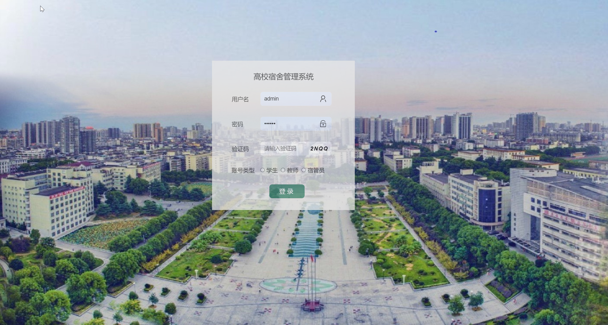
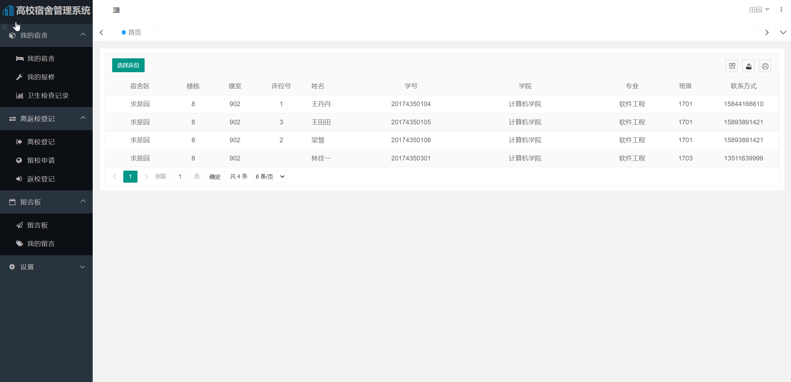
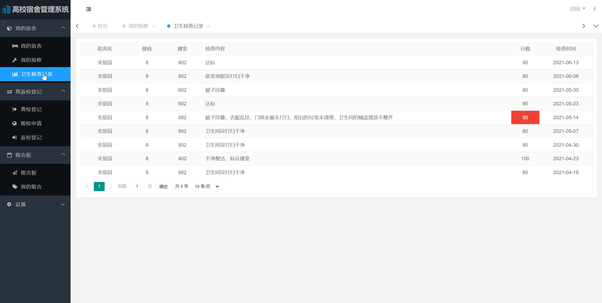
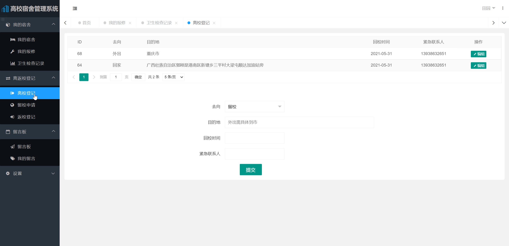
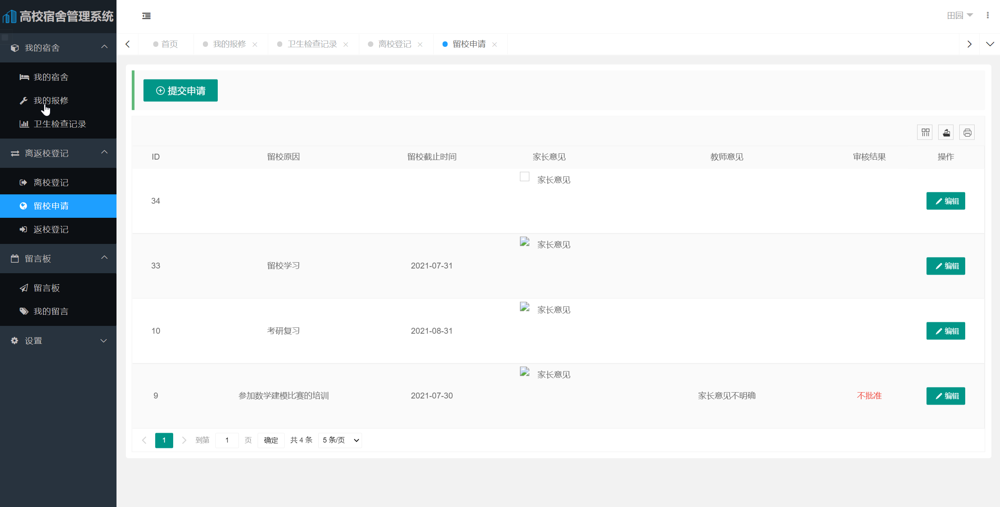
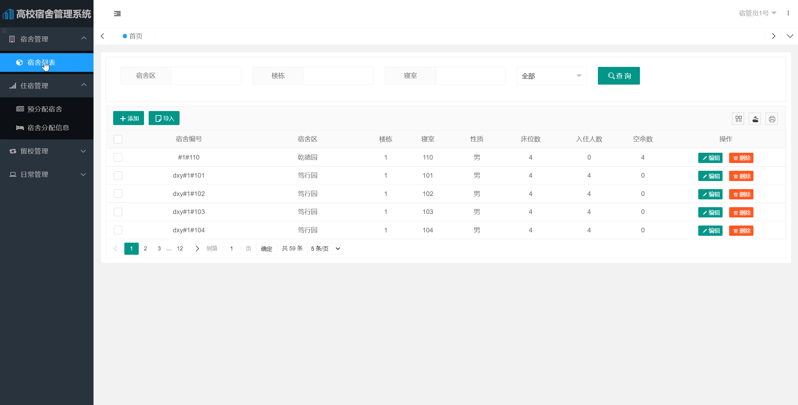
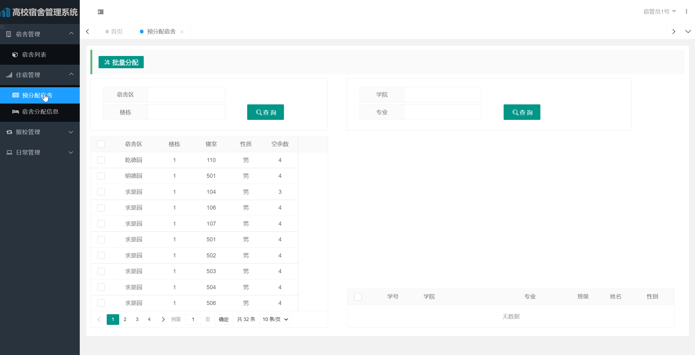
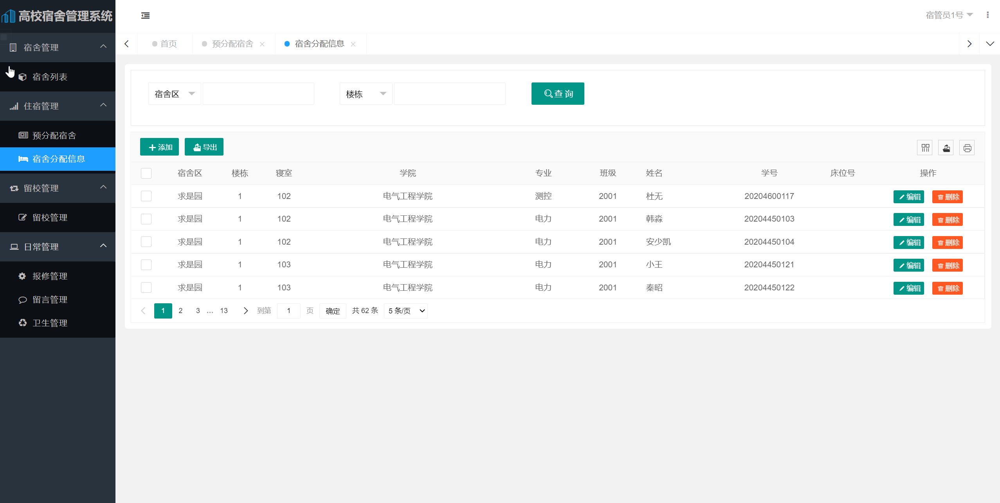
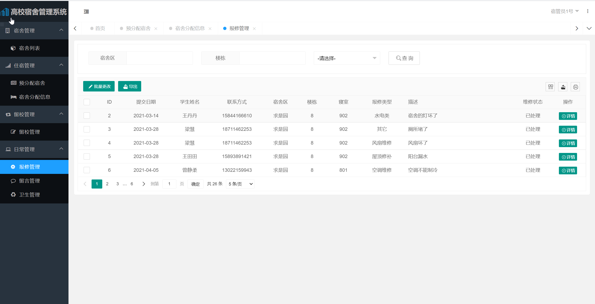
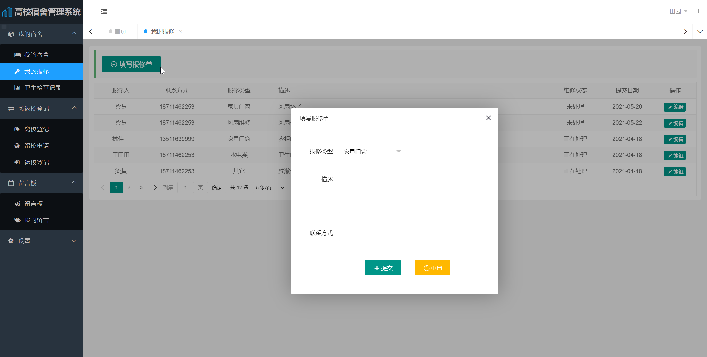

## 基于SpringBoot的高校宿舍管理系统(程序+报告)

- <b>完整代码获取地址：从戎源码网 ([https://armycodes.com/](https://armycodes.com/))</b>
- <b>技术探讨、资料分享，请加QQ群：692619798</b> 
- <b>作者微信：19941326836  QQ：952045282</b> 
- <b>承接计算机毕业设计、Java毕业设计、Python毕业设计、深度学习、机器学习</b>
- <b>选题+开题报告+任务书+程序定制+安装调试+论文+答辩ppt 一条龙服务</b>
- <b>所有选题地址 ([https://github.com/YuLin-Coder/AllProjectCatalog](https://github.com/YuLin-Coder/AllProjectCatalog)) </b>

## 项目介绍
基于SpringBoot的高校宿舍管理系统，本系统共分为2个角色：系统管理员、用户，主要功能如下

（1）基本信息管理

基本信息分为学生信息和宿舍信息两部分，其功能是负责维护这些信息，对它们进行增删查改等操作。

（2）宿舍分配管理

根据给定的宿舍信息与学生信息，按照一定的规则自动地给还未分配宿舍的

学生分配宿舍，学生可在该宿舍内自选床位，最终的宿舍分配信息可以以文件形

式（如 Excel 表格）导出。

（3）宿舍日常管理

主要包括卫生管理、报修管理、留言管理等。

卫生管理：记录并维护卫生检查信息。

报修管理：添加、查看、修改报修单信息。

留言管理：包括发布公告、失物招领、普通留言以及对这些信息的维护。

（4）离返校管理

对节假日学生的去向、寒暑假学生的留校以及返校登记信息进行统计及管

理，并以图表形式呈现统计信息。

（5）综合查询管理

包括查找学生信息、各楼栋/专业的学生宿舍分配情况、卫生检查情况、学

生离返校及留校信息、指定类型的留言、查看宿舍成员等。 

## 项目技术
- 编程语言：Java
- 数据库：MySQL
- 项目管理工具：Maven
- 前端技术：HTML、CSS、Jquery、ECharts
- 后端技术：Spring、SpringMVC、MyBatis

## 运行环境
- JDK版本：JDK1.8及以上
- 开发工具：IDEA、Ecplise、Myecplise都可以
- 数据库: MySQL5.7及以上
- Maven：maven3.0及以上

## 运行截图

